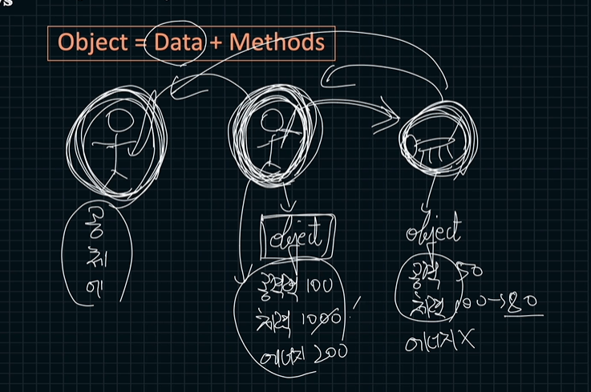
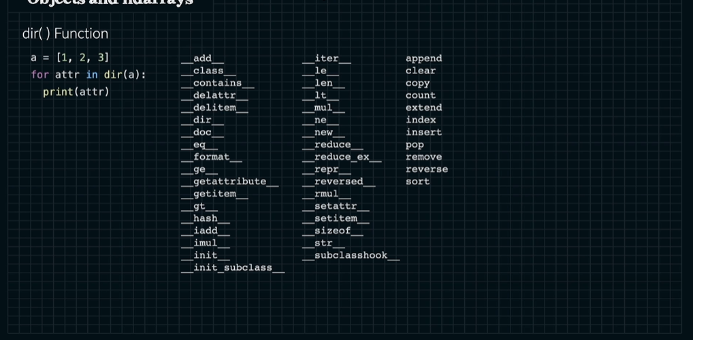
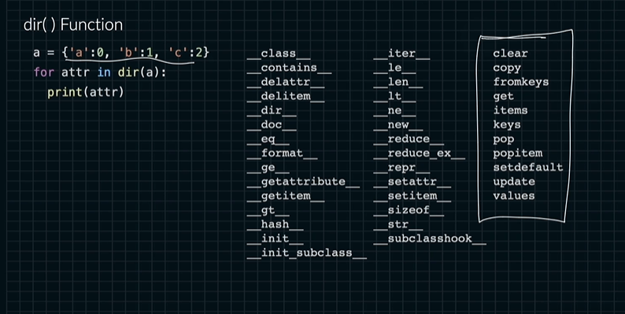

# 오브젝트와 ndarrays
오브젝트는 데이터와 메소드의 집합임.

예시중 하나가 게임임.

```python
a = [1,2,3]
a.append(5)
```
리스트도 오브젝트임. 
append()도 하나의 메서드임.

오브젝트를 만드는 과정을 instantation이라고 불림.

파이썬에서는 .으로 메소드를 접근할 수 있음.

len은 스페셜 메소드입니다. 그냥 함수가 아니고요.

넘파이에서 제공되는 오브젝트를 많이 쓸 거임.

클래스도 배울 거임.

인덴테이션이 뭐에요.

리스트를 만들었을 때 list와 variable가 뭐가 있을까

dir() function 

이렇게 스페셜 메소드를 볼 수 있어요.

딕셔너리

내가 원하는 기능을 만들기 위해 오브젝트를 인스턴스화 시킴.

왜 넘파이를 왜 쓰냐
넘파이가 제공하는 오브젝트를 사용하기 위함임.

클래스에 있는 self argument를 사용하는 데 애를 먹는 사람이 많음.

같은 메소드를 사용하고 있다.

리스트들의 같은 기능을 사용한다.

type function

어떤 오브젝트인지 확인해줘요.
