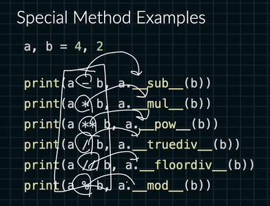
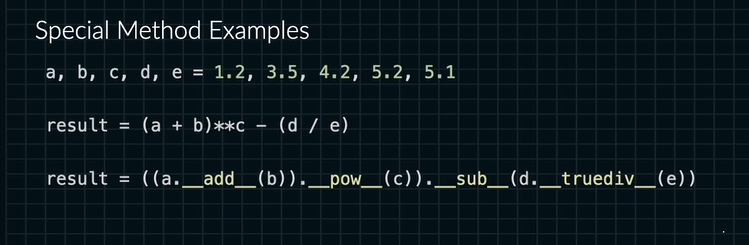
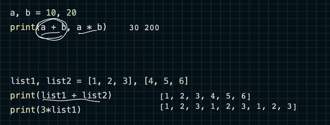
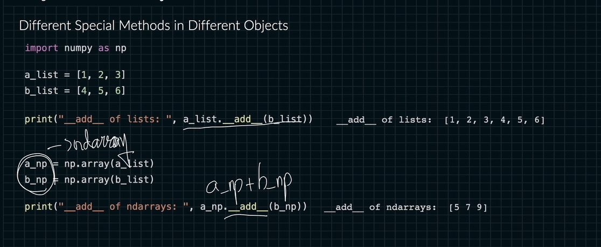

# 스페셜 메소드
스페셜 메소드가 충격인 이유 뿌슝빠슝

```python
a, b = 10, 20
```

zip() 같은 것 끼리 맞춰줌

오브젝트는 오브젝트와의 계산이 가능함.

```python
a+b 
a.__add__(b)
```

서로 같지만 +기호를 메소드로 인터프리터가 변환함.

```python
len(a)
a.__len__()
```
len을 아래에 있는 메소드로 인터프리터가 바꿔준다.


왼쪽으로 연산하는 것이 편함.
그러나 인터프리터는 오른족으로 변환해 사용됨

왜 오른쪽으로 안쓰냐?

이걸 한 번에 해석 가능하면 쓰세요.
근데 연산기호 쓰는게 더 편할 거에요.

이 과정을 인터프리터가 열심히 변환해주고 있는 거에요.


인터프리터는 이렇게 까지 변환해줘서 우리가 편하게 연산이 가능해요.


ndarray로 이렇게 원소화 시켜서 연산할 수 도 있어요

