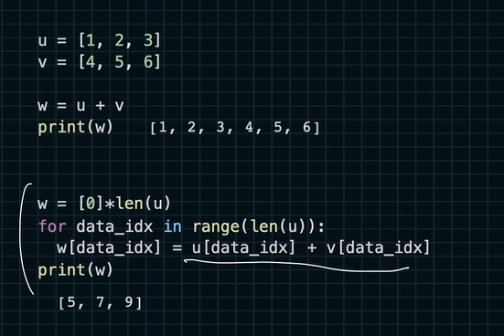
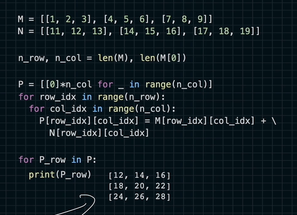
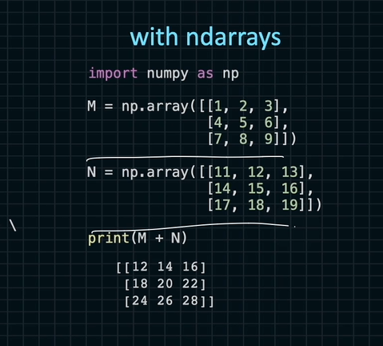

# ndarray 객체
넘파이가 제공하는 ndarray에 대한 간단한 소개

파이썬에서의 namespace

포토샵 말고 이미지처리하는 데 파이썬을 쓸 수 있음.

다양한 기능들이 있음

이미지 처리하는 걸 파이썬으로 만들다.

이미지 OpenCV
자연어 처리 NLTK
수학 numpy

파이썬 설치하는 과정에서 모든 라이브러리를 설치하는 것은 어려움

서드파티 라이브러리를 사용하기 위해 import 문을 사용함

namespace란?
기본적으로 제공하는 함수와 서드파티에서 제공하는 함수의 이름이 충돌될 때 namespace를 만들게 됨.

기본 함수는 sum()이라고 할 때
서드 파티 함수는 lib1.sum()으로 쓸 수 있음.

프로그램을 구현할 때 함수나 클래스를 만들 때 네임스페이스가 없다면 여러 서드파티 라이브러리를 사용할 때 일일히 이름에 대한 검사를 해야하고 이름을 바꿔야함.

```python
import numpy
scores = [1,2,3,4,5]
numpy.mean(scores) #평균
numpy.var(scores) #합계
```

이런 식으로 api를 사용할 수 있음.

약자로 바꾸어 쓸 수 있음.
```python
import numpy as np
a = np.array([1,2,3])
type(a) #<class 'numpy.ndarray'>
```

ndarray는 텐서의 계산을 위해 제공해주는 api다.

특징 하나.


위 연산을 아래 연산으로 바꿀 수 있음

```python
import numpy as np
u = np.array([1,2,3])
v = np.array([4,5,6])
u + v # [5 7 9]
```
가독성이 향상됨.

for 문을 사용하면 속도가 저하가 될 수 있음.

아래 연산을 더욱 추천함.
