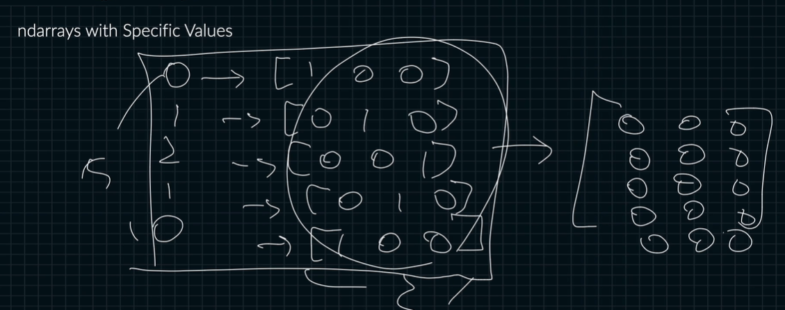

# shape로 ndarray 만들기
간단하게 만들기



```python
import numpy as np

M = np.zeros(shape=(2, 3))
M.shape # (2, 3)
M # [[0. 0. 0] [0. 0. 0]]

N = np.ones(shape=(2, 3))
N.shape # (2, 3)
N # [[1. 1. 1] [1. 1. 1]]

O = np.full(shape=(2, 3), fill_value=4)
O.shape # (2, 3)
O # [[4. 4. 4] [4. 4. 4]]

P = np.empty(shape=(2, 3)) # 원래 메모리 값을 참조해서 넣고 나중에 채울 거임.
P.shape # (2, 3)
p #[[4. 4. 4] [4. 4. 4]]
```

이미 존재하는 shape 참조

```python
import numpy as np

O = np.full(shape=(2, 3), fill_value=4)

zeros_like = np.zeros_like(O)

zeros_like # [[0. 0. 0] [0. 0. 0]]

ones_like = np.ones_like(O)

ones_like # [[1. 1. 1] [1. 1. 1]]

full_like = np.full_like(O, fill_value=5)

full_like # [[5. 5. 5] [5. 5. 5]]

empty_like = np.empty_like(O)

empty_like # [[5. 5. 5] [5. 5. 5]]
```

