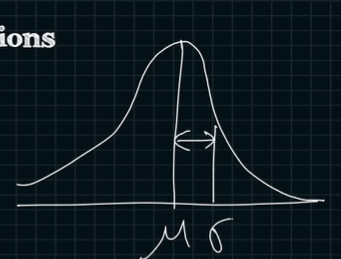
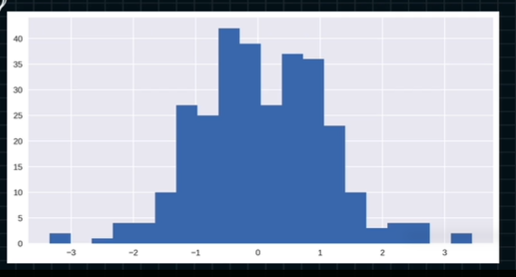
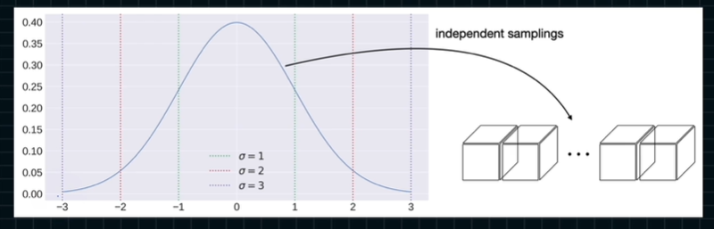
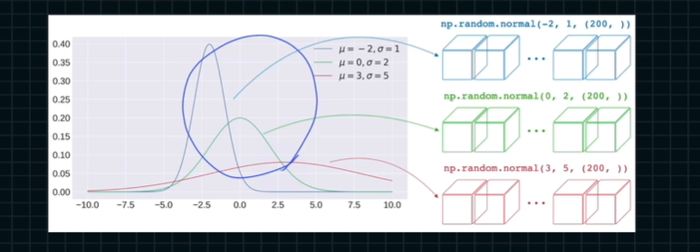
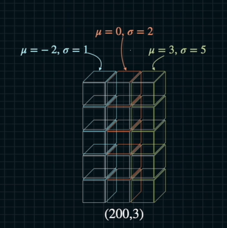
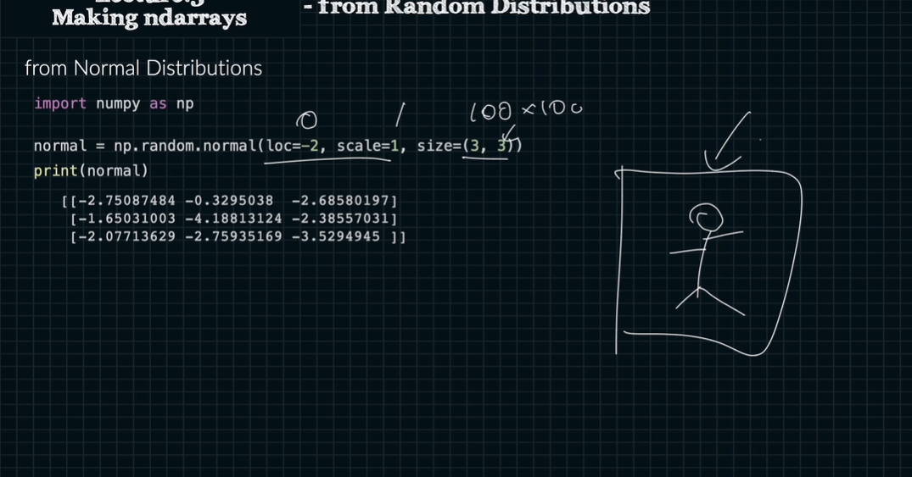
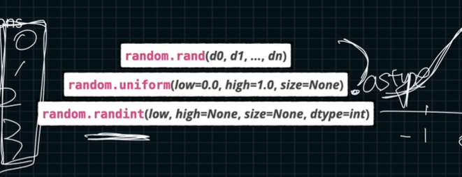
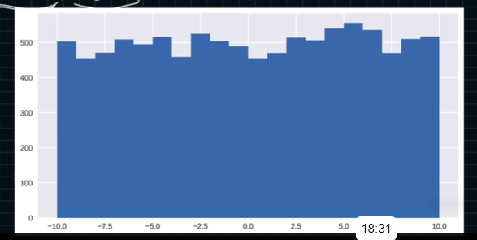

# 랜덤으로 ndarray 생성

어디서 랜덤으로 쓰냐?
테스트 데이터 셋을 생성할 때 사용함

normal distributions


```python
import numpy as np
import matplotlib.pyplot as plt

plt.style.use('seaborn')
fig, ax = plt.subplots(figsize=(10, 5))

rand = np.random.randn(300)
ax.hist(rand, bins=20)
print(rand.shape) # (300, )
```





```python
import numpy as np

normal1 = np.random.normal(loc=-2, scale=1, size=(200, ))

normal2 = np.random.normal(loc=0, scale=2, size=(200, ))

normal3 = np.random.normal(loc=3, scale=5, size=(200, ))

# 위 값과 아래 값은 동일한 값이다.

normal = np.random.normal(loc=[-2, 0, 3], scale=[1, 2, 5], size=(200, 3)) # for loop 을 없앨 수 있음.
```






uniform distributions



```python
import numpy as np

uniform = np.random.rand(2, 3, 4)
uniform.shape # (2, 3, 4)

uniform = np.random.uniform(low=-10, high=10, size=(10000, )) # -10에서 10까지 10000개의 랜덤한 수
```



```python
import numpy as np

randint = np.randint(low=0, high=7, size=(10, ))
randint # 4...(18 of random integer numbers)...0

```