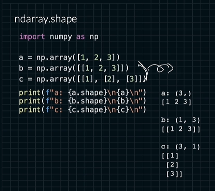

# ndarray 가 가지고 있는 메타데이터

왜 메타데이터를 가지고 오냐?

ndarray를 크게 보면 텐서를 가지고 노는 거임.

실수할 수 있는 여지가 굉장히 많음.

ndim 

shape 텐서의 모양
  reshape
  resize
  flatten
  ravel

size 

dtype
  astype

itemsize

nbytes

텐서를 계산할 경우 제대로 확인하기 어려움.

우린 다차원을 사용해서 연산할 거임.

케이스가 맞는 지 일일히 검토하기 어려움.

제대로 연산이 되었는 지 확인하기 위해서 메타데이터를 이용함.

실수를 줄일 수 있는 방법은 넘파이의 api를 제대로 숙지하기 위함.

어디서 실수가 발생했는 지 간단하게 확인가능하다.

중간중간 코드에서 확인할 거임

```python
import numpy as np

s_np = np.array(0)
v_np = np.array([0,1])
m_np = np.array([[0,1],[2,3]])
t_np = np.array([[[0,1],[2,3]],
                [[4,5], [6,7]]])

s_np.ndim # 0
v_np.ndim # 1
m_np.ndim # 2
t_np.ndim # 3

s_np.shape # ( )
v_np.shape # (2, )
m_np.shape # (2, 2)
t_np.shape # (2, 2, 2)
```


단순한 것 같지만 b와 c는 분명 다르다.

```python
import numpy as np

M = np.ones(shape=(10, ))
N = np.ones(shape=(3, 4))
O = np.ones(shape=(3, 4, 5))
P = np.ones(shape=(2, 3, 4, 5, 6))

M.size # 10
N.size # 12
O.size # 60
P.size # 720
```