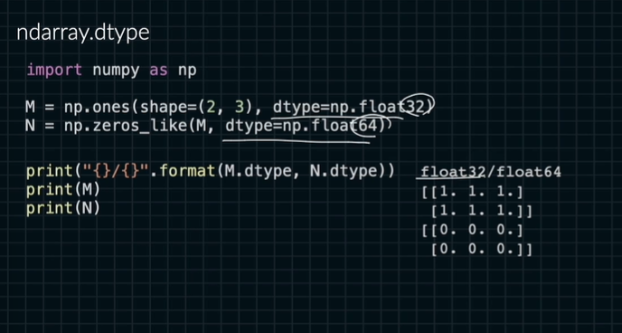

# ndarray의 메타데이터 2

```python
np.int # 8, 16, 32, 64
np.uint # 8, 16, 32, 64
np.float # 32, 64
```

데이터 타입을 최적화할 필요가 있음.

```python
import numpy as np

M = np.arange(100)
N = np.full(fill_value=2.5, shape=(2,3))

M.dtype # int64
N.dtype # float64

int_np = np.array([1, 2, 3]) # int64
float_np = np.array([1., 2., 3.]) # float64

int8_np = np.array([1, 2, 3], dtype = np.int8)
uint8_np = np.array([1, 2, 3], dtype = np.uint8)
float32_np = np.array([1, 2, 3], dtype = np.float32)

int8_np.size # 3
int8_np.itemsize # 1(B)
int8_np_cap = int8_np.size * int8_np.itemsize # 3(B)
int8_np.nbytes # 3(B)

uint8_np.size # 3
uint8_np.itemsize # 1(B)
uint8_np_cap = uint8_np.size *uint8_np.itemsize # 3(B)
uint8_np.nbytes # 3(B)

float32_np.size # 3
float32_np.itemsize # 4(B)
float32_np_cap = float32_np.size * float32_np.itemsize # 12(B)
float32_np.nbytes # 12(B)

```

