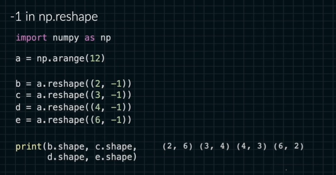
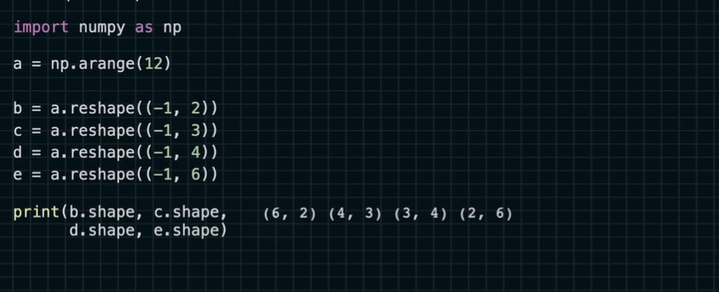
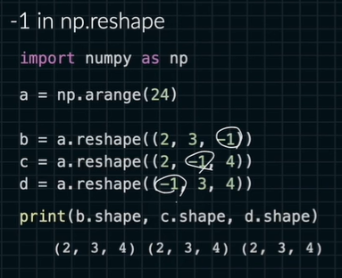
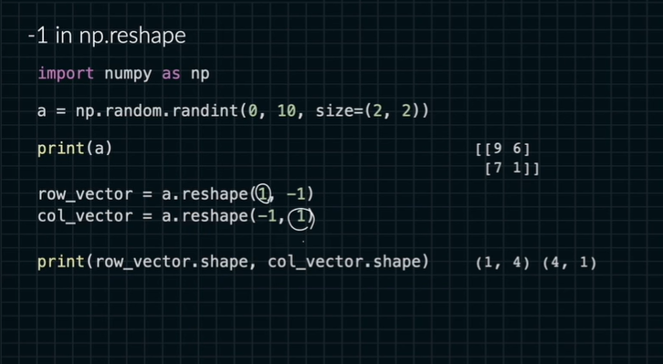
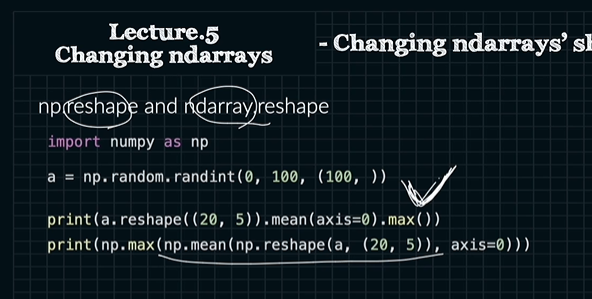

# reshape

```python
import numpy as np
>>> x = np.arange(20)      # x는 1차원 배열이다.
>>> x          
array([ 0,  1,  2,  3,  4,  5,  6,  7,  8,  9, 10, 11, 12, 13, 14, 15, 16,
       17, 18, 19])
       
>>> x.reshape(4,5)         # x를 (4,5) 2차원으로 바꾼 배열을 리턴한다.
array([[ 0,  1,  2,  3,  4],
       [ 5,  6,  7,  8,  9],
       [10, 11, 12, 13, 14],
       [15, 16, 17, 18, 19]])
>>> x.reshape(2,2,5)       # x를 (2,2,5) 3차원으로 바꾼 배열을 리턴한다.
array([[[ 0,  1,  2,  3,  4],
        [ 5,  6,  7,  8,  9]],

       [[10, 11, 12, 13, 14],
        [15, 16, 17, 18, 19]]])
        
>>> x                      # x는 변화하지 않고 그대로 유지됨을 볼 수 있다.
array([ 0,  1,  2,  3,  4,  5,  6,  7,  8,  9, 10, 11, 12, 13, 14, 15, 16,
       17, 18, 19])


a = np.arange(12)
b = a.reshape((2,-1))
c = a.reshape((3,-1))
d = a.reshape((4,-1))
e = a.reshape((6,-1))

b = a.reshape((-1,2))
c = a.reshape((-1,3))
d = a.reshape((-1,4))
e = a.reshape((-1,6))
```




