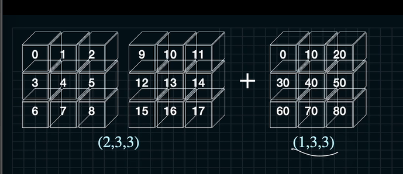
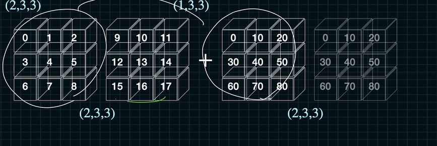
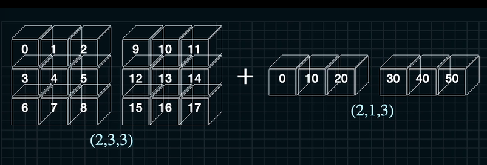
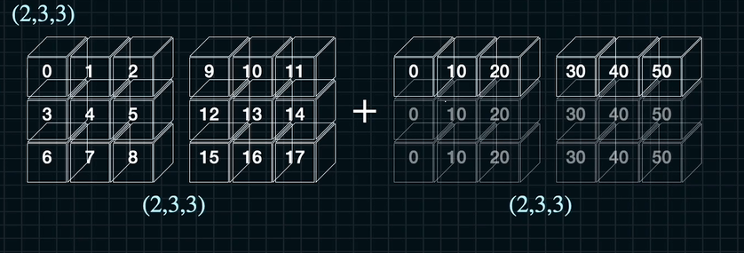
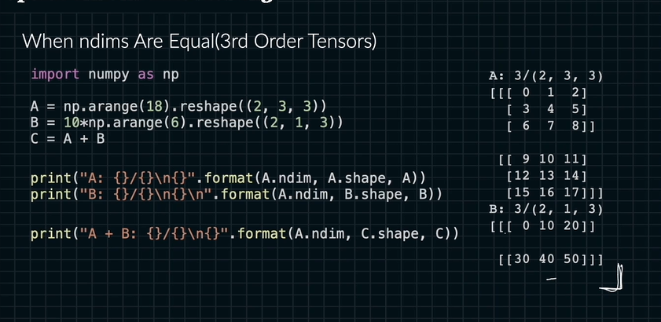
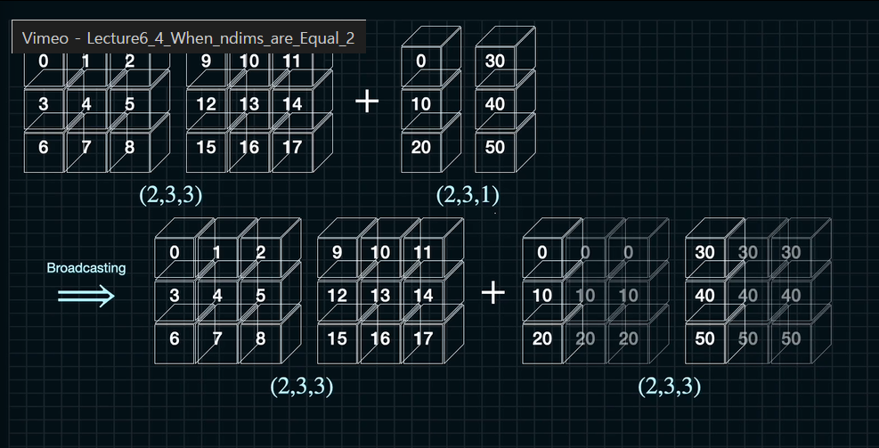

# 브로드 캐스팅

디멘션 비교를 할 때 주로 사용

3차원에서의 브로드 캐스팅

컬러 이미지에 노이즈를 삽입

ndarray 연산
(2, 3, 3) + [(1, 3, 3)+ (1, 3, 3)] = (4, 3, 3)

(1, 3)과 (3, 1)은 전혀 다른 ndarray이다.

우리가 어떤 연산을 하고 있는 지 계속 그려져야 한다.

브로드 캐스팅

