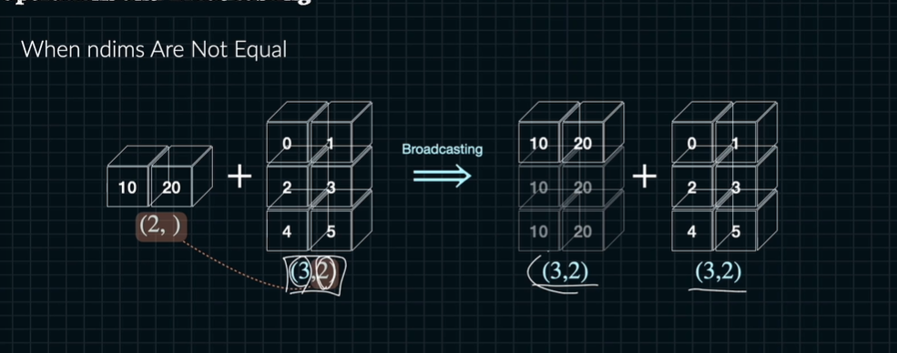
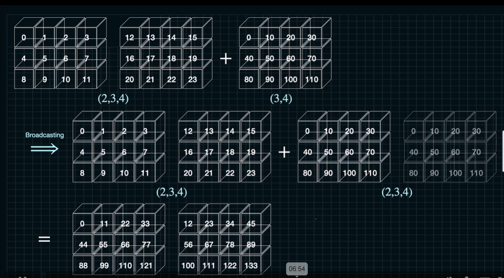
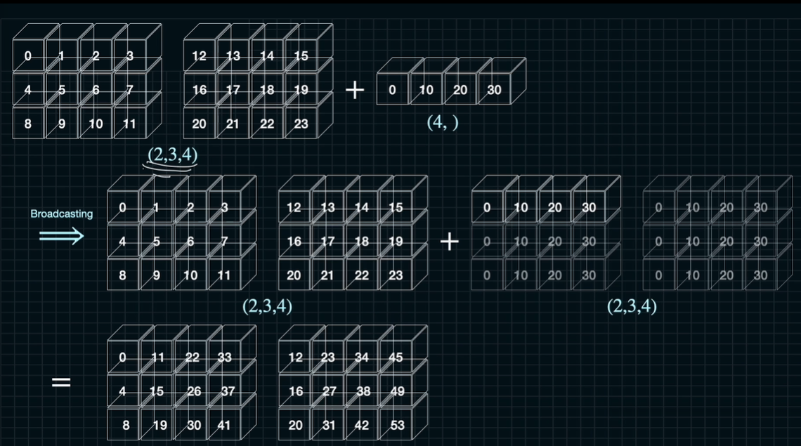

# ndim이 다를 때 브로드 캐스팅

```python
a = np.array(3) # 3
u = np.arage(5) # [0 1 2 3 4]

a * u # [0 3 6 9 12]

a > u # [True True True False False]
```



왼쪽 차원이 오른쪽 안쪽 차원에 맞춰져 있어야 함.





예시

A: (a, b, c, d, e)

B: (b, c, d, e)

C: (c, d, e)

D: (d, e)

E: (e)

