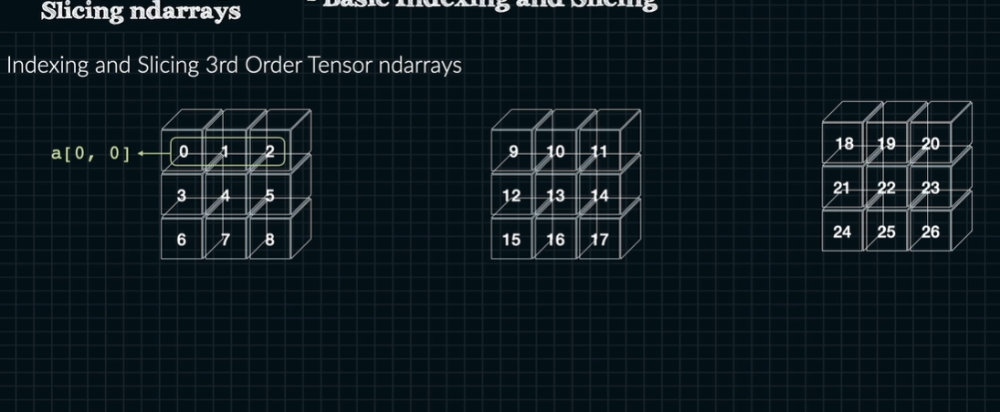

# 3차원 이상의 인덱싱과 슬라이싱



```python
import numpy as np

a = np.arange(3*3*3).reshape((3,3,3))

a[0, :2, :2] # [[0 1] [3 4]]
a[1, :2, :] # [[9 10 11] [12 13 14]]
a[2, -2:, -2:] # [[22 23] [25 26]]

a[0, ...] # [[0 1 2] [3 4 5] [6 7 8]]

a[..., 0] # [[0 3 6] [9 12 15] [18 21 24]]

a[1:, -2:, -2:]
# [[[13 14] [16 17]]
#  [[22 23] [24 25]]]
```

