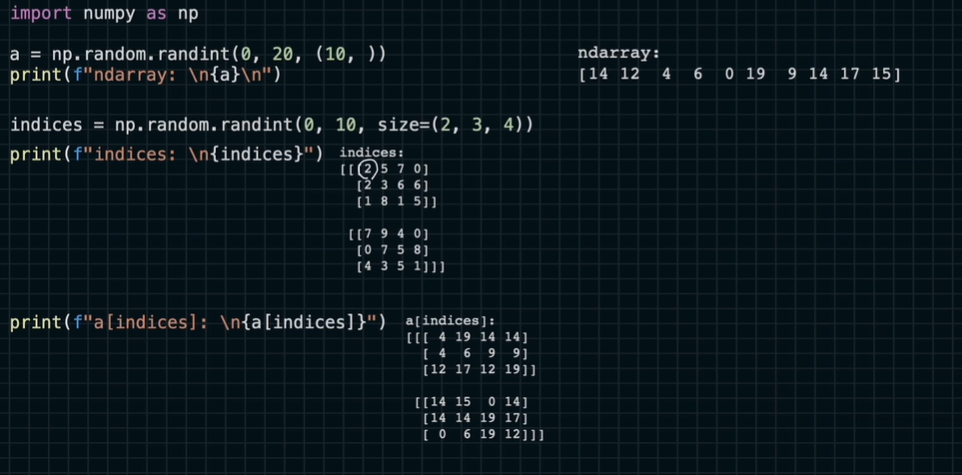
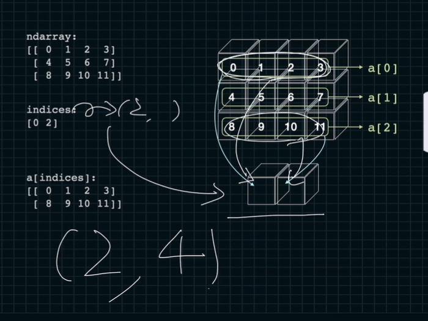
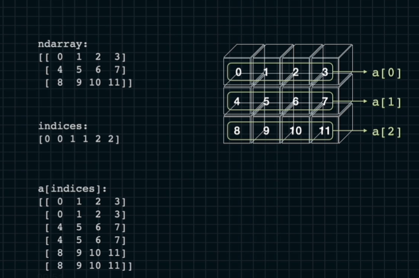
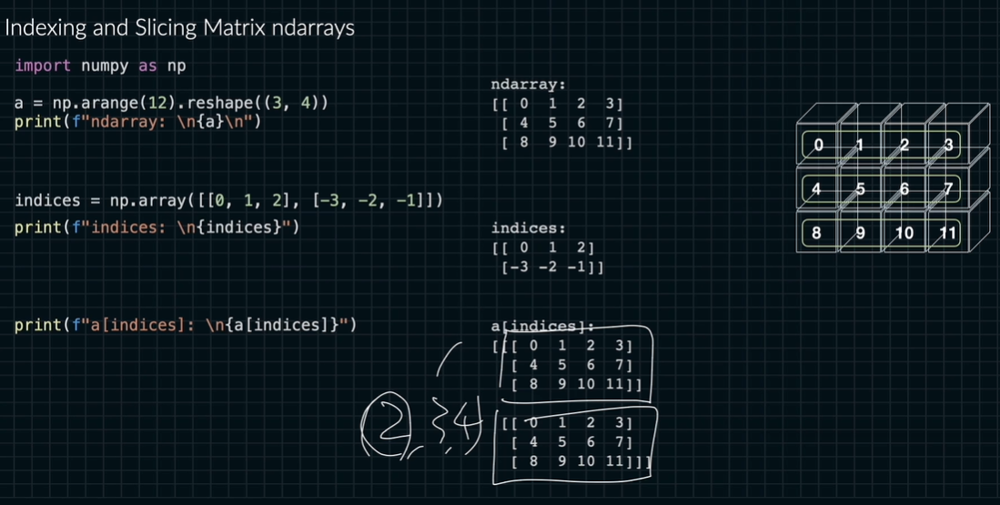

# ndarray에서의 인덱싱

실제로 다른 api와 같이 사용됨.

슬라이싱은 규칙적인 인덱스만 가져올 수 있음.

그러나 불규칙으로 인덱스를 가져 올때는?

```python
import numpy as np

a = np.arrange(10)
# [0 ... 9]
indices = np.array([0,3,4])
# [0 3 4]
```

뽑고 싶은 인덱스만 가져올 수 있음

그러나 같은 값을 같이 가져오고 싶을 때는?
```python
import numpy as np

a = np.arrange(10)
# [0 ... 9]
indices = np.array([0,0,5,5])
# [0 0 5 5]
```

순서를 다르게 하거나 행렬을 만들고 싶은 때는?

```python
import numpy as np

a = np.arrange(10)
# [0 ... 9]
indices = np.array([[1, 2, 3],[5, 6, 4]])
# [[1 2 3] [5 6 4]]
a[indices] 
# [[1 2 3] [5 6 4]]
```

3차원

```python
import numpy as np

a = np.random.randint(0, 20, (10, )) #0부터 20 직전 까지 10개의 0차원으로
indices = np.random.randint(0, 10, size=(2,3,4))
#0부터 10직전까지 2 x 3 x 4로
a[indices]
```








```python
import numpy as np

a = np.arange(12).reshape((3, 4))
# [
#   [0 1 2 3]
#   [4 5 6 7]
#   [8 9 10 11]
#]
i0, i1 = np.array([0, 1, 2]), np.array([1, 2, 3])
# (0, 1), (1, 2), (2, 3)
a[i0, i1]
#[1 6 11]
```

2개의 차원에서는 스칼라 값에 접근함.


```python
import numpy as np

a = np.arange(12).reshape((3, 4))
# [
#   [0 1 2 3]
#   [4 5 6 7]
#   [8 9 10 11]
#]
i0, i1 = np.array([[0, 1, 2], [0, 1, 2]]), np.array([[0, 1, 2], [1, 2, 3]])
# i0 (0, 0), (1, 1), (2, 2)
# i1 (0, 1), (1, 2), (2, 3)
a[i0, i1]
#[[0 5 10] [1 6 11]]
```