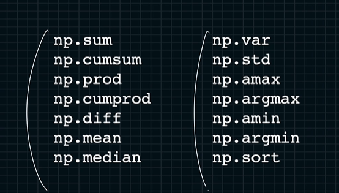
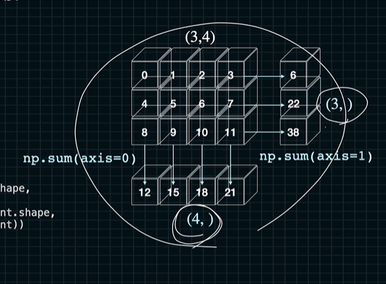

# 행렬에서의 axis 와 keepdims 
우리가 쓸건 for 문을 없앨 수 있다.


axio와 keepdims를 사용하기 위한 api임

axis를 제대로 사용할 수 없지만 작동방식 알려드림

속도도 빨라여

```python
import numpy as np
a = np.arange(5)
np.sum(a) # 10 
a.sum() # 10

m = np.arange(6).reshape((2, -1))
np.sum(m) # 15
m.sum() # 15
```

그러나 axis를 알긴 위해선...

```python
import numpy as np
a = np.arange(12).reshape((3, -1))
sum0 = a.sum(axis=0) # axis 0번째를 기준으로 합
sum1 = a.sum(axis=1) # axis 번째를 기준으로 합
a #[[0 1 2 3] [4 5 6 7] [8 9 10 11]]
sum0 #[12 15 18 21] <- 이거만 남음 0번째 차원이 없어짐
sum1 #[6 22 38] <- 이거만 남음 1번째 차원이 없어짐
```


만약 남기고 싶다?

```python
import numpy as np
a = np.arange(12).reshape((3, -1))
sum0 = a.sum(axis=0, keepdims=True) # axis 0번째를 기준으로 합 + 0번째 안사라짐
sum1 = a.sum(axis=1, keepdims=True) # axis 번째를 기준으로 합 + 1번째 안사라짐
a #[[0 1 2 3] [4 5 6 7] [8 9 10 11]]
sum0 #[[12] [15] [18] [21]] 
sum1 #[[6] [22] [38]] 
```