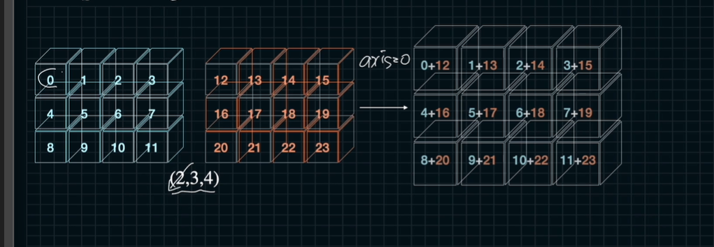
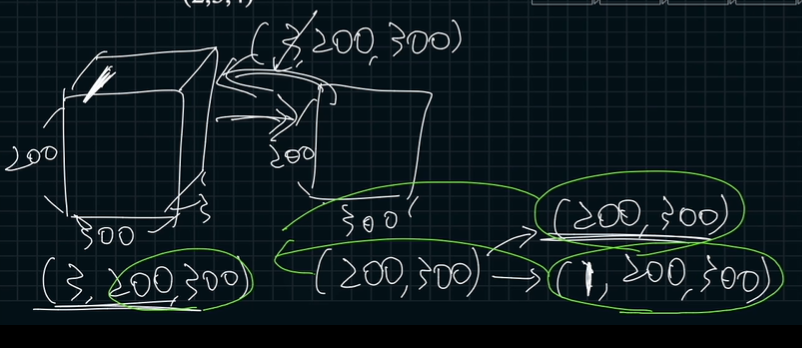
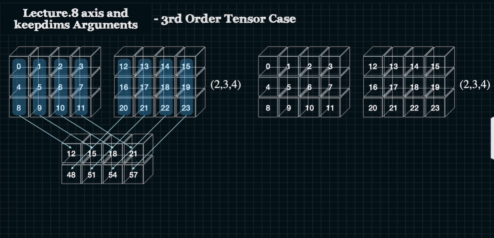

# 텐서에서의 axis 와 keepdims 





```python
import numpy as np

a = np.arange(2*3*4).reshape((2,3,4))

sum_no = a.sum(axis=0)
# [[12 14 16 18]
# [20 22 24 26]
# [28 30 32 34]]
```



```python
import numpy as np

a = np.arange(2*3*4).reshape((2,3,4))

sum_no = a.sum(axis=1) # (2, 4)
# [[12 15 18 21]
# [48 51 54 57]]
sum_yes = a.sum(axis=1, keepdims=True) # (2, 1, 4)
# [[[12 15 18 21]]
# [[48 51 54 57]]]
```

마지막 차원

```python
import numpy as np

a = np.arange(2*3*4).reshape((2,3,4))

sum_no = a.sum(axis=2) # (2, 3)
# [[6 22 38] [54 70 86]]
sum_yes = a.sum(axis=2, keepdims=True) # (2, 3, 1)
# [[[6] [22] [38]]
#  [[54] [70] [86]]]
```