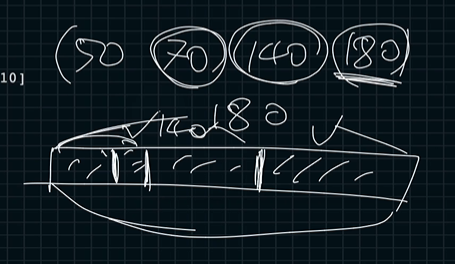
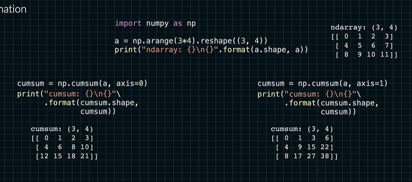
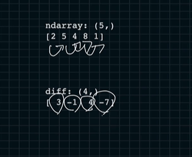
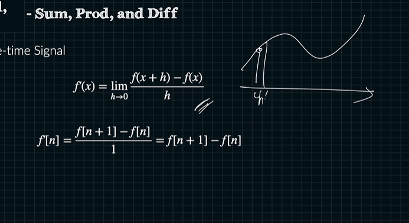
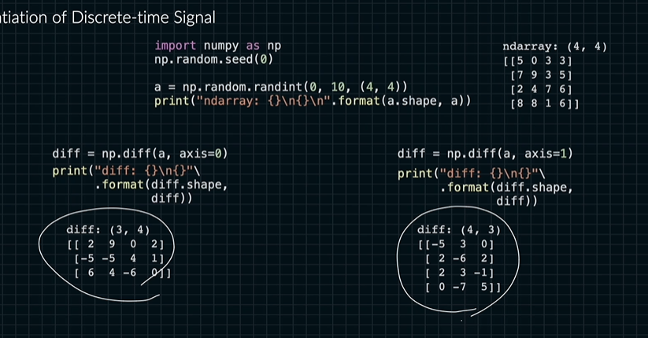

# ndarray 의 합곱차

넘파이 api를 사용하면 쉽고 빠르게 구할 수 있음

```python
import numpy as np
a = np.arange(5) # [0 1 2 3 4]
cusum = np.cumsum(a) #[0 1 3 6 10] 누적시키며 덧셈
```

보통 시각화를 시킬 때 사용함.



```python
import numpy as np
a = np.arange(9).reshape((3,3))
np.cumsum(a).shape() #axis가 없을 경우 벡터 
#[0 1 3 6 10 15 21 28 36]

a = np.arange(3*4).reshape((3, 4))
cusum = np.cumsum(a, axis =0)#매트릭스
```



```python
import numpy as np

a = np.arange(1, 5)
prod = np.prod(a)#[24] 1 * 2 * 3 * 4
cumprod = np.cumprod(a) # [1 2 6 24]

a = np.arange(1, 13).reshape((3, 4))
prod = np.prod(a, axis=0)#[[1 2 3 4] .... [9 10 11 12]]
cumprod = np.cumprod(a, axis=0) # [[1 2 3 4] [5 12 21 32] [45 120 231 384]]
```

diff 뭐가 다른지
ndarray에서 차이를 구하는 것

```python
import numpy as np
a = np.array([2, 5, 4, 8, 1])
diff = np.diff(a)
print(diff) # [3 -1 4 -7]
```




와 미분 아시는 구나

```python
a = np.array([[5, 0, 3, 3],
              [7, 9, 3, 5],
              [2, 4, 7, 6],
              [8, 8, 1, 6]])

diff = np.diff(a, axis=0)
print(diff) 
#[[2 9 0 2] 
# [-5 -5 4 1] 
# [6 4 -6 0]]
```

행 하나 줄어들어요
